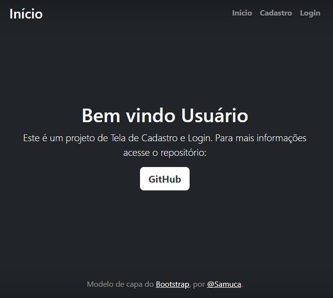
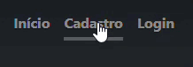
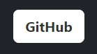
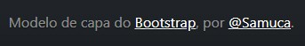
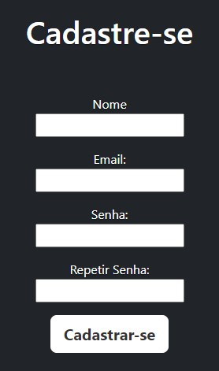
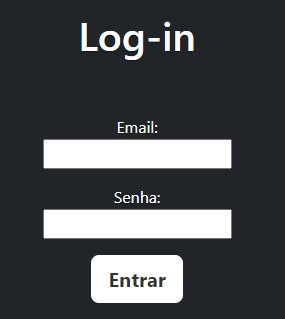

# Índice

[Projeto - aplicação de cadastro e login](#projeto---aplica%C3%A7%C3%A3o-de-cadastro-e-login)

[Descrição](#descri%C3%A7%C3%A3o)

[Introdução](#introdu%C3%A7%C3%A3o)

[Funcionalidades](#funcionalidades)

[Tecnologias utilizadas](#tecnologias-utilizadas)

[Fontes consultadas](#fontes-consultadas)

[Autor](#autor)

# Projeto - aplicação de cadastro e login
 
## Descrição
 
Uma página de links de navegação onde terá as opções de "início", "Cadastro" e "Login", além de contar com a opção "Github" que será usada para visualizar o repositório no GitHub.
 
 
## Introdução

☝️Parte inicial da página. Aqui é onde o usuário será direcionado caso selecione a opção "início" no topo da página.
 

 
☝️Menu do site, aqui o usuário navega entre as páginas.
 

 
☝️Botão que redireciona o usuário para o repositório do GitHub para mais informações.
 

 
☝️Local dos agradecimentos/menções, citando o autor e o local de onde foi utilizado o código fonte.
 

 
☝️Página onde o usuário realizará o cadastro, inserindo suas informações nos espaços em branco, de acordo com o que cada um solicita, e após isso, pressionará o botão "Cadastrar-se" para se cadastrar no site. (Projeto futuro)
 

 
☝️Página onde o usuário realizará o login, inserindo suas informações que foram utilizadas no Cadastro, e depois pressionará o botão "Entrar" para acessar sua conta. (Projeto futuro)
 
## Funcionalidades
 
**Cadastro**: Redireciona o usuário para a página de cadastro, onde ele poderá realizar o cadastro no site (Projeto futuro).
 
 
**Login**: Redireciona o usuário para a página de Log-in, onde ele poderá acessar sua conta no site (Projeto de funcionalidade futura), caso ele tenha feito um cadastro.
 
 
**Botão "GitHub"**: Redireciona o usuário para o repositório do GitHub.
 
 
**Botão "Cadastrar-se"**: Cadastra o usuário no site (Projeto futuro).
 
 
**Botão "Entrar"**: Permite o usuário entrar em sua conta. (Projeto futuro)
 
 
 
**Bootstrap**: Redireciona o usuário para o site oficial do [Bootstrap](https://getbootstrap.com/)
 
 
 
**@Samuca**: Redireciona o usuário para a página no LinkedIn do criador da página. [@Samuca](https://linkedin.com/in/samuel-cmfarias)
 

### Tecnologias utilizadas
 
Este site foi desenvolvido com a ajuda do **Visual Studio Code** para codificação, **HTML5** para marcação de conteúdo, **CSS3** para estilização e **GitHub** para hospedagem do projeto.
 
## Fontes consultadas

Foi usado o bootstrap para a estrutura inicial do site e o repositório do Armstrong Lohãns para modelo de README.
 
* [Bootstrap](https://getbootstrap.com) - O Modelo De Index Usado
 
* [Armstrong Lohãns](https://gist.github.com/lohhans/f8da0b147550df3f96914d3797e9fb89) - Um modelo para fazer um bom README

## Autor

<a href="https://github.com/SamuelCmdeFarias">
 
  
 <b>Samuel Camargo</b></a> <a href="https://github.com/SamuelCmdeFarias" title="Rocketseat">🚀</a>

❤️👋🏽.
